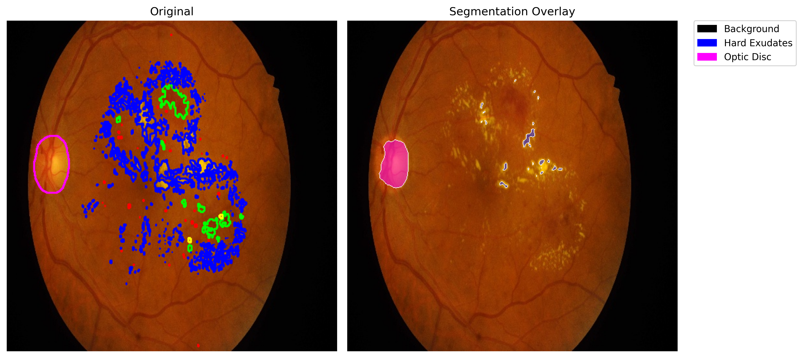

# VLM Project to generate patient report for diabetic retinopathy 

## Objective
- To diagnose diabetic retinopathy from fundus images and generate a report using VLM's for patients that shows the severity of disease and current eye health. 

## Output classes and abnormalities
1) Optic disc 
2) Hard exudates
3) Soft exudates
4) Microaneurysms 
5) Haemorrhages
6) Background (Weight = 0.03, Extremely downweighted)

## Models tried
1) Segmentation (UNet++) + Gemma

## Proposed architecture
### Segmentation + Gemma
#### Current architecture
- Using UNet++ model with timm-efficientnet-b3 encoder and imagenet weights
for segmenting fundus images into optic disc and multiple abnormalities.
- Hyperparameters:
  1) No of epochs: 25
  2) Learning rate: 3e-4
  3) Batch size: 3
  4) Image size: 512
  5) No. of output classes: 6
- Loss: 0.5 * dice_loss + 0.5 * ce_loss
- Optimizer: Adam optimizer with weight decay 1e-4

## Metrics
- Train IoU ~ 0.40–0.44
- Training loss (0.5 * dice_loss + 0.5 * ce_loss): 0.37
- Validation total loss (0.5 * dice_loss + 0.5 * ce_loss): 0.36
- Training loss curve:

## Conclusion
### Stage-1 (Application of segmentation model to detect and mark abnormalities)

### Stage-2 (Using VLM model to generate summary report of fundus abnormalities)