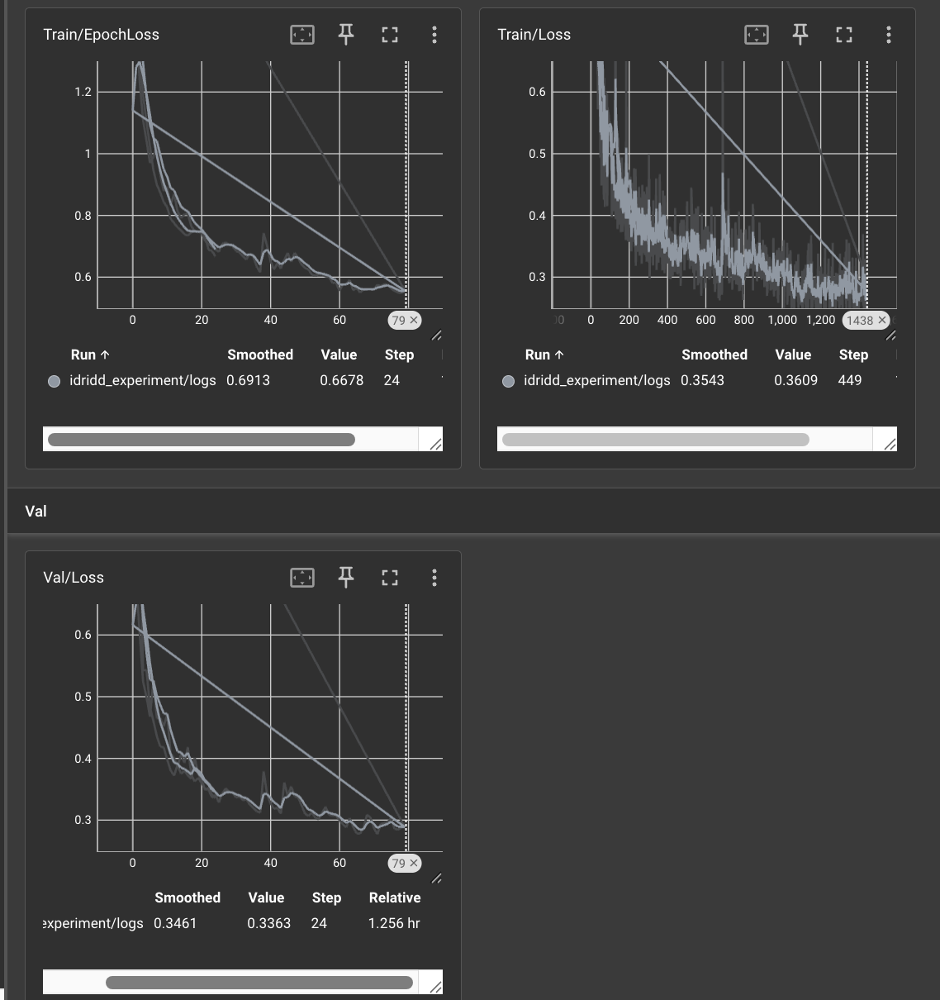
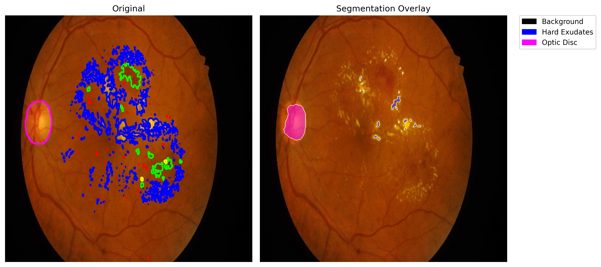

# Diabetic retinopathy analysis  

## Objective
Diagnose diabetic retinopathy from fundus images and generate a structured report using Vision Language Models for patients, showing the severity of disease and current eye health. 

## Output classes and abnormalities
1) Optic disc 
2) Hard exudates
3) Soft exudates
4) Microaneurysms 
5) Haemorrhages
6) Background (Weight = 0.03, Extremely downweighted)

## Preprocessing
The IDRiD dataset is preprocessed into a single multi-class mask per image and resized to `512×512` before training.
### Raw data
The raw data is in data/raw/ folder in the IDRiD format, we need to convert to a format that can be read by PyTorch's data preprocessing modules.
### What it does
 - Combines the per-abnormality masks (e.g., `*_MA.tif`, `*_HE.tif`, etc.) into a single mask where each pixel value is an integer label:
   - `0` = background
   - `1` = MA (Microaneurysms)
   - `2` = HE (Haemorrhages)
   - `3` = EX (Hard Exudates)
   - `4` = SE (Soft Exudates)
   - `5` = OD (Optic Disc)
 - Resizes all images and masks to **512×512**
 - Writes processed data to:
   - `data/processed/train/images/`, `data/processed/train/masks/`
   - `data/processed/test/images/`, `data/processed/test/masks/`

### Running preprocessing
Preprocessing runs automatically when training starts (it is triggered by `src/training/init_dataset.py`).

To run it explicitly:
```bash
python -c "from src.training.init_dataset import dataset_builder_train; dataset_builder_train.create_dataset('train')"
python -c "from src.training.init_dataset import dataset_builder_test; dataset_builder_test.create_dataset('test')"
```

> Tip: Delete `data/processed/` to force regeneration of processed images/masks.

## Models tried
1) Segmentation (UNet++) + Qwen2-VL-2B-Instruct

## Proposed architecture
### Segmentation + Qwen
#### Current architecture
- Using UNet++ model with timm-efficientnet-b3 encoder and imagenet weights
for segmenting fundus images into optic disc and multiple abnormalities.
- Hyperparameters:
  1) No of epochs: 25
  2) Learning rate: 3e-4
  3) Batch size: 3
  4) Image size: 512
  5) No. of output classes: 6
- Loss: 0.5 * dice_loss + 0.5 * ce_loss
- Optimizer: Adam optimizer with weight decay 1e-4

## Metrics
- Train IoU ~ 0.40–0.44
- Training loss (0.5 * dice_loss + 0.5 * ce_loss): 0.37
- Validation total loss (0.5 * dice_loss + 0.5 * ce_loss): 0.36
- Training loss curve:


## Setup
On command line:
- Execute 'make train' to start training the model.
- Execute 'make visualize' to visualize the final segmented image generated by the model.

## Conclusion
### Stage-1 (Application of segmentation model to detect and mark abnormalities)


### Stage-2 (Using VLM model to generate summary report of fundus abnormalities)
Uses Qwen2-VL-2B-Instruct to generate a structured, patient-facing summary 
based on the segmented retinal image output from the Stage-1 segmentation model. 

The model describes detected fundus abnormalities and provides a model-estimated 
diabetic retinopathy severity level.

#### Sample output
Instruction prompt:
Provide a detailed structured report of the segmented retinal image on the right, ignore the original image on left and assess diabetic retinopathy severity based on segmented image on right and the labels.
assistant
The segmentation overlay for the retinal image in Figure 1 shows different types of abnormalities that can be used to assess diabetic retinopathy (DR) severity.

##### Original Image:
- **Background**: The dark area at the bottom is likely the background or non-retina tissue.
- **Haemorrhages**: These appear as bright red areas scattered throughout the retina.
- **Hard Exudates**: These are darker green patches with irregular shapes.
- **Soft Exudates**: These are lighter green patches with more defined borders compared to hard exudates.
- **Optic Disc**: This appears as a pinkish-red oval shape located near the top center of the image.

##### Segmentation Overlay:
- **Background**: The dark area remains unchanged from the original image.
- **Haemorrhages**: The haemorrhage regions remain visible but may have slightly changed their appearance due to the segmentation process.
- **Hard Exudates**: The hard exudate regions show some changes; they now appear less distinct and possibly merged into larger clusters.
- **Soft Exudates**: The soft exudate regions also seem to merge together, forming larger clusters.
- **Optic Disc**: The optic disc region retains its position and coloration similar to the original image.

##### Assessment Based on Segmented Image:

Based on this segmentation overlay, we can observe several key features related to DR severity:

###### Haemorrhages:
- **Redness**: Presence of significant reddening suggests advanced stages of DR where hemorrhagic macular edema has developed.
- **Distribution**: The distribution pattern indicates whether there's an extensive involvement across multiple quadrants or if it’s localized within one quadrant.

###### Hard Exudates:
- **Size and Shape**: Larger and denser clusters suggest severe DR where exudative lesions have formed over time.
- **Uniformity**: Uniform size and shape indicate consistent progression without regression phases.

###### Soft Exudates:
- **Density and Distribution**: Smaller and more dispersed clusters suggest moderate DR where new exudations are developing slowly.
- **Pattern**: Randomly distributed patterns might indicate early-stage DR before the development of large confluent masses.

###### Optic Disc:
- **Color and Position**: Normal-looking optic discs imply no immediate signs of DR affecting vision.
- **Shape and Size**: Slightly smaller than normal could indicate mild DR affecting peripheral vision.

In summary, while the overall structure of the image remains largely intact after segmentation, the presence of increased density and uniformity in certain areas like the optic disc and the presence of larger clusters of exudates suggest higher levels of DR severity. However, further analysis would require clinical correlation and additional diagnostic tools such as OCT scans or fluorescein angiography.